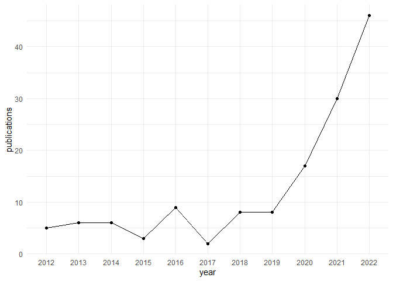
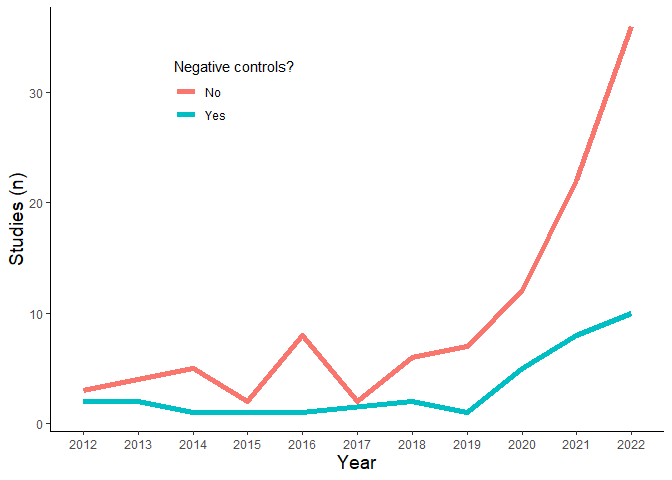

## Code for figure X

### Raphael Eisenhofer 25/7/2023

## Load packages and data in, set theme

``` r
library(tidyverse)
library(janitor)

df <- read_delim("../data/DataTable.csv", delim = ',') %>%
  clean_names() %>%
  mutate(year = str_extract(study_id, "[:digit:].*"))
```

## Plot of studies through time

``` r
#Get counts of publications per year
df %>%
  filter(year != "2023") %>%
  group_by(year) %>%
  summarise(publications = n()) %>%
#Line plot it
  ggplot(aes(x = year, y = publications, group = 1)) +
  geom_line() +
  geom_point() +
  theme_minimal()
```

 \## Plot
of studies through time (controls vs. none)

``` r
#Get counts of publications per year
df %>%
  filter(year != "2023") %>%
  group_by(year, were_there_negative_controls) %>%
  summarise(publications = n()) %>%
#Line plot it
  ggplot(aes(x = year, y = publications, 
             group = were_there_negative_controls, 
             colour = were_there_negative_controls)) +
  geom_line() +
  geom_point() +
  theme_classic() +
  theme(
    legend.position = c(0.3, 0.8),
    axis.title = element_text(size = 14)
  ) +
  labs(x = "Year", y = "Studies (n)", colour = "Negative controls?")
```

    ## `summarise()` has grouped output by 'year'. You can override using the
    ## `.groups` argument.


